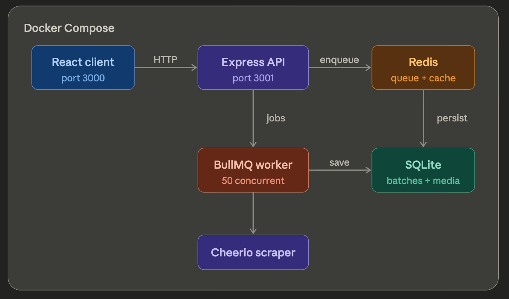
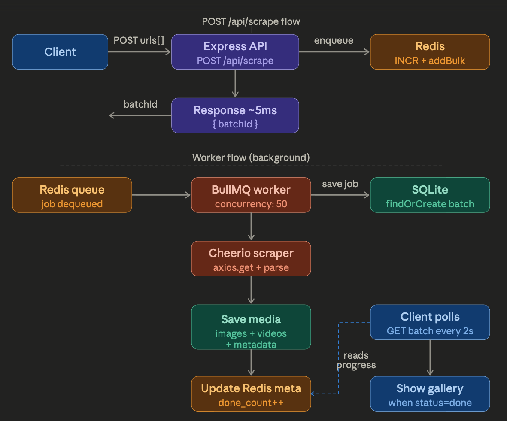

# Media Scraper

## How to run

### Docker

```bash
docker-compose up --build
```

The Client will be running at `http://localhost:3000`

### Local

```bash
# Install dependencies
npm install

# Run the server
cd server
npm run dev

# Run the client
cd client
npm run dev
```

The Client will be running at `http://localhost:5173` and the Server will be running at `http://localhost:3001`.

## Design Overview





### Overview Architecture

```
React (port 3000)
    └── Nginx proxy /api
            └── Express API (port 3001)
                    ├── Redis  ← queue + batch metadata
                    └── BullMQ Worker (concurrency: 50)
                            ├── Cheerio ← scrape HTML
                            └── SQLite  ← save media items
```

### Flow: Submit scrape

```
User paste URLs
    → POST /api/scrape
    → Redis INCR (get batchId)
    → addBulk (push jobs into queue)
    → Response trả batchId (~5ms)

Frontend use batchId to poll progress every 2 seconds
```

### Flow: Worker process

```
Redis queue
    → Worker dequeue (50 jobs parallel)
    → Create batch + job in SQLite
    → Axios download HTML
    → Cheerio extract img/video URLs
    → Save media_items into SQLite
    → Update Redis meta (done_count++)
```

### Why achieve ~5000 requests?

API does not scrape in request handler — only push into Redis (5ms).
Worker self-regulate at 50 concurrent jobs — never OOM.

## Tech Stack

### Back-end

- Node.js
- TypeScript
- SQLite
- Express
- Axios
- Cheerio
- BullMQ
- Redis

### Front-end

- ReactJS (Vite)
- TypeScript
- TanStack React Query
- Tailwind CSS
- Shadcn UI

## How to run load-test

### Requirements

- Node 20
- k6: `brew install k6`

### Steps

1. Run Redis by docker-compose

```bash
docker-compose up -d redis
```

or

```bash
docker-compose up docker-compose.dev.yml
```

2. Run worker

```bash
cd server
npm install
npm run worker
```

3. Run Server

```bash
cd server
npm run dev
```

4. Run Load Test command

```bash
k6 run ./server/src/load-tests/scrape.js
```

### Load Test Result

- Load test config

```
stages: [
  { duration: '30s', target: 500 },
  { duration: '60s', target: 2000 },
  { duration: '60s', target: 4000 },
  { duration: '60s', target: 5000 },
  { duration: '30s', target: 0 }
],
thresholds: {
  http_req_duration: ['p(95) < 1000'],
  http_req_failed: ['rate < 0.02'],
  error_rate: ['rate < 0.02']
}
```

- Load Test Summary

```
==== Load Test Summary ====
  Total requests: 670478
  Failed requests : 3331
  Avg Latency: 372.66ms
  p95 Latency: 941.58ms
  p99 Latency: 1283.23ms
  Error rate: 0.62%
============================

running (4m00.4s), 0000/5000 VUs, 670478 complete and 0 interrupted iterations default
```

## Performance Improvement by time

Create a Job Record for every URL from the request

-> Batching SQL Insert for all URLs one time

-> Use Redis to store job metadata, while pushing the jobs to BullMQ to do later
